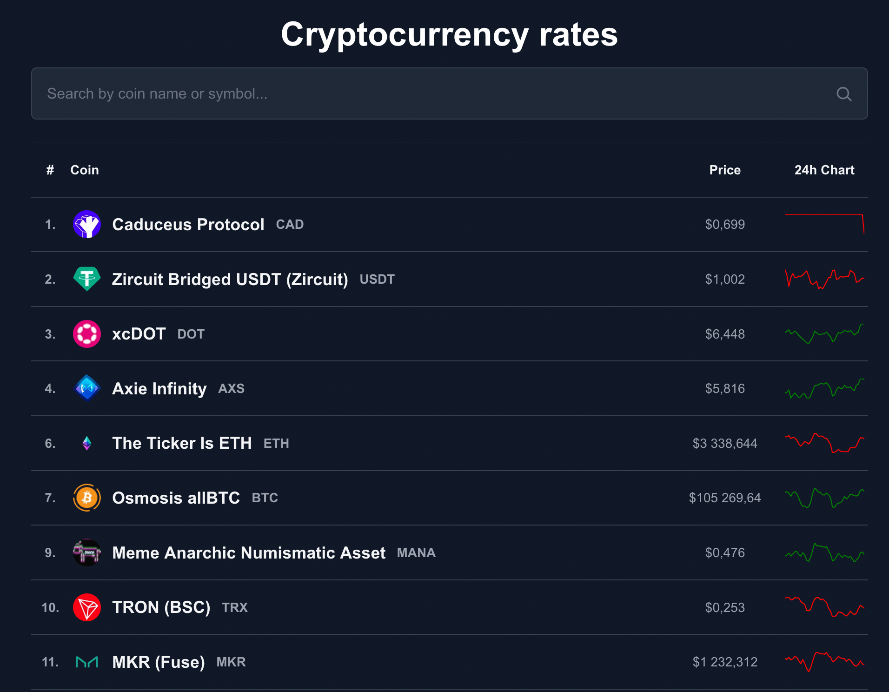
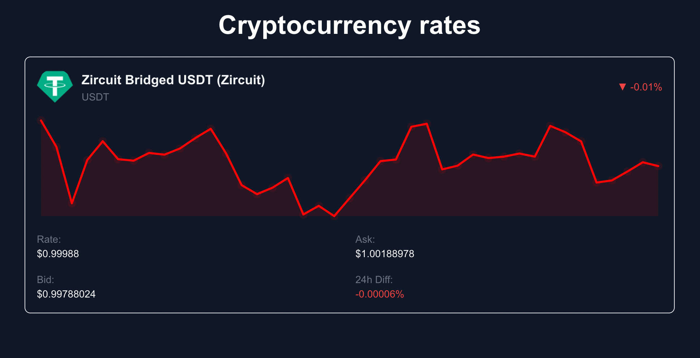

# Cryptocurrency Rates

## Overview

Cryptocurrency Rates is a single-page application built with **React** and **TypeScript**. It fetches and displays cryptocurrency rates relative to USD using the **YouHodler API** for price data and chart visualization, and allows users to view detailed information for individual cryptocurrencies. The app integrates the **CoinGecko API** for cryptocurrency images.

<div align="center" style="margin: 30px 0;">
  
  
<br />
  <a href="https://github.com/ratmirslv/cryptocurrency-rates/actions/workflows/production.yaml">
    
  </a>
</div>

## Stacks & Tools

<a target="_blank" rel="noopener noreferrer" href="https://nextjs.org"></a>
<a target="_blank" rel="noopener noreferrer" href="https://react.dev"></a>
<a target="_blank" rel="noopener noreferrer" href="https://www.typescriptlang.org"></a>
<a target="_blank" rel="noopener noreferrer" href="https://tailwindcss.com">

</a>
<a target="_blank" rel="noopener noreferrer" href="https://tanstack.com/query/latest"></a>
<a target="_blank" rel="noopener noreferrer" href="https://zod.dev"></a>

---

## Features

- **Cryptocurrency List Page (`/`)**

  - Displays a list of cryptocurrencies with basic details: Name, Ticker, Price, and Chart.
  - Links to detailed pages for each cryptocurrency.

- **Cryptocurrency Details Page (`/${ticker}`)**

  - Provides detailed information about the selected cryptocurrency: Rate, Ask Price, Bid Price, and 24-Hour Price Movement.
  - Fetches and displays the cryptocurrency's logo using the CoinGecko API.
  - Displays interactive charts of historical rates using data from the YouHodler API.

- **Error Handling**

  - Gracefully handles API failures and invalid data.

- **Responsive Design**
  - Ensures a seamless user experience across devices.

---

## Bonus Features

- **Filtering**: Allows users to filter the cryptocurrency list by specific criteria, improving usability and accessibility.
- **Interactive Charts**: Displays historical price trends with data from the YouHodler API.

---

## Installation

1. Clone the repository:

```bash
git clone <repo-url>
```

2. Navigate to the project directory:

```bash
cd cryptocurrency-rates
```

3. Install dependencies:

```bash
npm install
```

---

## Scripts

### Development

Start the application in development mode:

```bash
npm run dev
```

### Build

Build the application for production:

```bash
npm run build
```

### Start

Start the production server:

```bash
npm run start
```

### Linting

Lint the codebase:

```bash
npm run lint
```

### Type Checking

Check TypeScript types:

```bash
npm run check-types
```

---

## Deployment

The application is deployed using [Vercel](https://vercel.com). For deployment, follow these steps:

1. Build the project:
   ```bash
   npm run build
   ```
2. Deploy the `.next` folder to your chosen hosting platform.

---

## Author

**Ratmir Aitov**
[Email](mailto:ratmirslv@gmail.com)

---

## License

This project is licensed under the MIT License.
